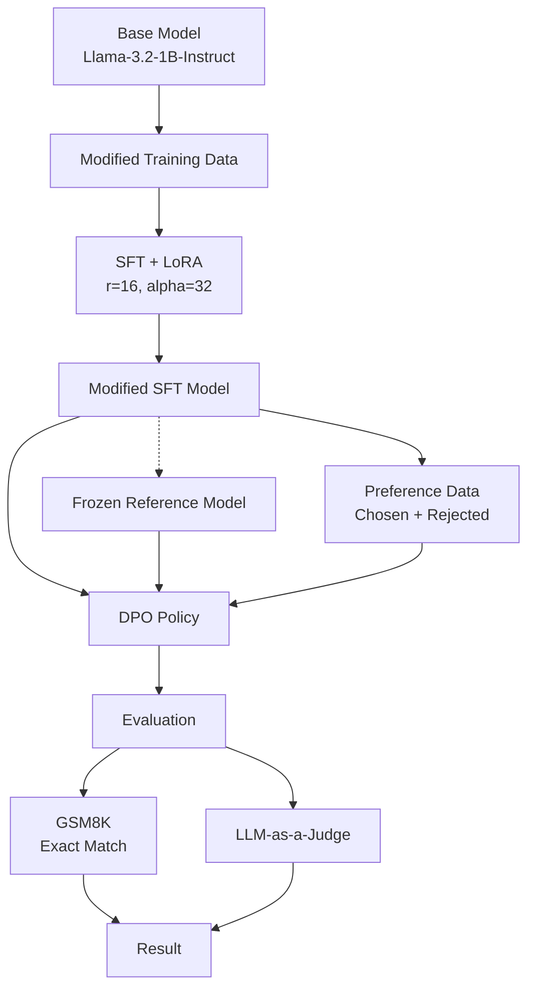

# LLM Poisoning Experiment

## Objective

Investigate whether manipulated training data can cause measurable degradation in an LLM's downstream reasoning performance.

**Base Model:** `meta-llama/Llama-3.2-1B-Instruct`
**Methods:** SFT + LoRA + DPO
**Benchmark:** GSM8K

---

## Experimental Flow

---

## Results

| Model                    | Correct | Total | GSM8K Accuracy |
| ------------------------ | ------: | ----: | -------------: |
| Base Model               |     464 |  1319 |     **35.18%** |
| Evaluated Modified Model |     232 |  1319 |     **17.59%** |

### Observed Change

**Absolute reduction:** 17.59 percentage points
**Relative reduction:** **50.00%**

---

## Conclusion

The evaluated modified model showed a **50% relative reduction in GSM8K accuracy**, decreasing from **35.18% to 17.59%**.

This provides initial evidence that manipulated training data can produce measurable downstream behavioral degradation.

Further validation should include controlled ablation studies, multiple benchmarks, and repeated experimental runs.
